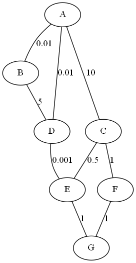

# Exercice 1

1. Le code commence par créer une pile vide `Q` puis dépile tous les éléments de `P` jusqu'à ce que cette pile soit vide. Chacun des éléments est immédiatement empilé dans `Q`.

    On obtient donc la pile : $(Queue)\,4\,\rightarrow 2 \rightarrow 5 \rightarrow 8\,(Sommet)$


2. On propose le code suivant :

    ```python
    def hauteur_pile (P):
        Q = creer_pile_vide()
        n = 0
        while not (est_vide(P)):
            n = n + 1
            x = depiler(P)
            empiler(Q, x)
        while not(est_vide(Q)):
            x = depiler(Q)
            empiler(P, x)
        return n
    ```


3. Si l'on cherche le maximum à partir de l'élément `i`, on doit déjà s'assurer que la pile compte au moins `i` éléments. Ensuite on parcourt tous les éléments jusqu'au `i`-ième en stockant la position du maximum.

    ```python
    def max_pile(P, i):
        assert i <= hauteur_pile(P), "La pile compte moins de i éléments"

        # Initialisation
        rang = 1  # L'indice de l'élément en cours de traitement
        rang_maxi = 1  # le rang du maximum en cours
        maxi = depiler(P)  # au début, le maximum est le premier élément ...
        empiler(P, maxi)  # ... que l'on rempile immédiatement
        Q = creer_pile_vide()  # une pile vide pour stocker les éléments traités

        # On lit tous les éléments jusqu'au i-ième pour trouver le maximum
        while rang <= i:
            x = depiler(P)
            if x > maxi:
                maxi = x
                rang_maxi = rang
            empiler(Q, x)
            rang += 1

        # On reconstitue la pile P
        while not(est_vide(Q)):
            empiler(P, depiler(Q))

        return rang_maxi
    ```


4. On va dans un premier temps s'assurer que la pile `P` contient au moins `j` éléments. Puis on dépile ces `j` éléments dans une nouvelle pile `Q`. On vide alors `Q` dans une troisième pile `R`. Vider `R` dans `P` a alors pour effet de retourner les valeurs comme souhaité.

    ```python
    def retourner(P, j):
        assert j <= hauteur_pile(P), "La pile compte moins de j éléments"

        # Initialisation
        Q = creer_pile_vide()  # une pile vide pour vider P
        R = creer_pile_vide()  # une pile vide pour vider Q
        rang = 1  # le rang de l'élément en cours de traitement

        # On dépile les j premiers éléments dans Q
        while rang <= j:
            empiler(Q, depiler(P))
            rang += 1

        # On vide Q dans R
        while not(est_vide(Q)):
            empiler(R, depiler(Q))

        # On vide R dans P
        while not(est_vide(R)):
            empiler(P, depiler(R))

        return None
    ```

5. On s'autorise à réutiliser les fonctions des questions précédentes. Le pseudo-code est le suivant :

    ```
    Fonction tri_crepes(P) :
        Vérifier que P est non-vide et renvoyer une erreur si ce n'est pas le cas

        h = hauteur_pile(P)

        Pour i allant de 0 à h (exclus) :
            # inutile de retourner la dernière crêpe en fin de boucle car c'est la plus petite
            rang_maxi = maxi_pile(P,h-i) 
            # on cherche le rang de l'élément maximal parmi les h-i premiers
            retourner(P,rang_maxi) # On retourne le haut de la pile jusqu'à l'élément maximal
            retourner(P,h-i) # On retourne toute la pile jusqu'en bas
    ```

    En python cela donne :

    ```python
    def tri_crepes(P) :
        assert not est_vide(P), "Il n'y a pas de crêpes à trier !"

        h = hauteur_pile(P)

        for i in range(0, h):
            rang_maxi = max_pile(P, h-i)
            retourner(P, rang_maxi)
            retourner(P, h-i)

        return None
    ```


# Exercice 2

1. 
    1. Pour aller de la case $(0,0)$ à la case $(2,3)$ on fait $3$ déplacements vers la droite et $2$ vers le bas.

    2. Comme on fait des déplacements de $1$ pas à chaque étape, il faut faire $2+3=5$ déplacements. Chaque déplacement nous amène sur une nouvelle case. En n'oubliant pas d'inclure la case $(0,0)$ il faut donc parcourir $2+3+1=6$ cases.


2. On liste tous les chemins et les sommes associées :

    | Chemin  | Somme |
    |---|---|
    | $(0,0)\rightarrow(0,1)\rightarrow(0,2)\rightarrow(0,3)\rightarrow(1,3)\rightarrow(2,3)$  | $11$  |
    | $(0,0)\rightarrow(0,1)\rightarrow(0,2)\rightarrow(1,2)\rightarrow(1,3)\rightarrow(2,3)$  | $10$  |
    | $(0,0)\rightarrow(0,1)\rightarrow(0,2)\rightarrow(1,2)\rightarrow(2,2)\rightarrow(2,3)$  | $14$  |
    | $(0,0)\rightarrow(0,1)\rightarrow(1,1)\rightarrow(1,2)\rightarrow(1,3)\rightarrow(2,3)$  | $9$   |
    | $(0,0)\rightarrow(0,1)\rightarrow(1,1)\rightarrow(1,2)\rightarrow(2,2)\rightarrow(2,3)$  | $12$  |
    | $(0,0)\rightarrow(0,1)\rightarrow(1,1)\rightarrow(2,1)\rightarrow(2,2)\rightarrow(2,3)$  | $12$  |
    | $(0,0)\rightarrow(1,0)\rightarrow(1,1)\rightarrow(1,2)\rightarrow(1,3)\rightarrow(2,3)$  | $10$  |
    | $(0,0)\rightarrow(1,0)\rightarrow(1,1)\rightarrow(1,2)\rightarrow(2,2)\rightarrow(2,3)$  | $14$  |
    | $(0,0)\rightarrow(1,0)\rightarrow(1,1)\rightarrow(2,1)\rightarrow(2,2)\rightarrow(2,3)$  | $13$  |
    | $(0,0)\rightarrow(1,0)\rightarrow(2,0)\rightarrow(2,1)\rightarrow(2,2)\rightarrow(2,3)$  | $16$  |

    La somme maximale est donc de $16$.


3.  
    1. Le tableau `T'` est le suivant :

    |  |  |  |  |
    | --- | --- | --- | --- |
    | $4$ | $5$ | $6$ | $9$ |
    | $6$ | $10$ | $8$ | $10$ |
    | $9$ | $10$ | $15$ | $16$ |
   
    2. La valeur `T'[0][j]` où `j` est non nul correspond à la somme des cases $(0,0)$ à $(0,j)$, c'est à dire des cases de la première ligne du tableau.

        Il n'y a qu'un seul chemin qui corresponde à cette somme et il passe obligatoirement par la case à gauche (d'indice `j-1`) de la case $(0,j)$.

        Donc pour calculer la somme `T'[0][j]` on ajoute simplement la valeur de la case $(0,j)$ (c'est à dire `T[0][j]`) à la somme obtenue à la case précédente (c'est à dire `T'[0][j-1]`).

        On a donc bien `T'[0][j] = T[0][j]+T'[0][j-1]`.

4. Si `i` et `j` son non-nuls, il y a deux chemins amenant à la case $(i,j)$. Le premier provient de la case du dessus $(i-1,j)$, le second de la case de gauche $(i,j-1)$.

    La valeur de `T'[i][j]` s'obtient donc en ajoutant la valeur de `T[i][j]` au maximum des deux chemins menant à cette case : `max(T'[i-1][j],T'[i][j-1])`.

5. 
    1. Le cas de base est atteint lorsque l'on atteint un case de la première ligne (`i` vaut $0$) ou de la première colonne (`j` vaut 0). Dans ce cas on calcule la somme en additionnant toutes les cases précédant la case en question sur la première ligne (si `i` vaut $0$) ou sur la première colonne (si j vaut $0$).

    2. On a :

    ```python
    def somme_max(T, i, j):
    if i == 0 and j == 0:
        return T[0][0]
    elif i == 0 :
        s = 0
        for k in range(j+1) :
            s += T[0][k]
        return s
    elif j == 0 :
        s = 0
        for k in range(i+1) :
            s += T[k][0]
        return s
    else :
        return T[i][j] + max(somme_max(T,i-1,j), somme_max(T,i,j-1))
    ```

    3. On appelle `somme_max(T,2,3)`.


# Exercice 3

1. La taille d'un arbre est le nombre de noeuds. Ici elle vaut $9$. La hauteur de l'arbre est la longueur du chemin le plus long entre la racine et l'une des feuilles. Ici $4$.

2.  
    1. Le numéro associé à $G$ est $1010$.
    
    2. Le nombre $13$ s'écrit $1101$ en binaire. Il correspond donc au noeud $I$.
    
    3. Les noeuds les plus bas sont numérotés sur $h$ bits ($4$ dans l'exemple).
    
    4. Un arbre de hauteur $h$ peut avoir au minimum $n$ noeuds (un noeud par niveau). Donc $h\le n$.

        A l'autre extrème, si l'arbre est complet (tous ses niveaux sont remplis) alors la racine a pour code $1$, les noeuds du premier niveau ont pour code $10$ et $11$, ceux du deuxième niveau $100$, $101$, $110$ et $111$, *etc...*
        
        Les codes des noeuds du niveau $h$ s'écrivent sur $h$ bits.
        
        L'ensemble des codes correspond donc aux nombres entiers pouvant s'écrire sur $h$ bits sauf le nombre $0$ qui ne correspond à aucun noeud (la racine est le $1$).
        
        Il y a $2^h$ valeurs possibles sur $h$ bits. Donc en retirant le $0$ on obtient $2^h-1$.

        On a donc bien :
        $$h \le n \le 2^h-1$$

3. 
    1. Le tableau est : 
    `[None,"A","B","C","D","E","F","G","H","I","J","K","L","M","N","O"]`
    
    2. L'indice du père d'un noeud d'indice $i \ge 2$ est le quotient entier de $i$ par $2$ (`i//2` en python).

4. On propose le code ci-dessous :

    ```python
    def recherche(arbre, element):
        taille = len(arbre)

        i = 1

        while i < taille:
            if arbre[i] == element:
                return True
            elif element < arbre[i]:
                i = 2*i
            else:
                i = 2*i+1

        return False
    ```


# Exercice 4

1. 
    1. L'attribut `num_eleve` est la clé primaire. Elle permet d'identifier de façon certaine chacun des objets de la table/relation.
    
    2. On a :

        ```sql
        INSERT INTO seconde (num_eleve,langue1, langue2, option, classe)
        VALUES ("133310FE","anglais", "espagnol", "", "2A")

        ```

    3. On fait :

        ```sql
        UPDATE seconde 
        SET langue1 = "allemand"
        WHERE num_eleve = "156929JJ"
        ```

2. 
    1. Cette requête renvoie les numéros d'identification de tous les élèves de seconde.

    2. Cette requête permet de compter le nombre d'élèves de seconde.

    3. On fait :

        ```sql
        SELECT COUNT(num_eleve) FROM seconde
        WHERE langue1 = "allemand" OR langue2 = "allemand"
        ```

3. 
    1. L'ajout d'une clé étrangère permet de s'assurer que les données des tables se correspondent. Elle peut aussi permettre d'empêcher d'ajouter des objets dans une table s'ils ne sont pas présents dans l'autre.

    2. On fait :

        ```sql
        SELECT nom, prenom, datenaissance FROM eleve
        JOIN seconde ON seconde.num_eleve = eleve.num_eleve
        WHERE seconde.classe = "2A"
        ```

4. On peut faire :

    | coordonnees |  |  |
    |--|--|--|
    | `num_eleve` | clé primaire | clé étrangère de la table seconde |
    | `adresse` |  |  |
    | `code postal` |  |  |
    | `ville` |  |  |
    | `mail` |  |  |


# Exercice 5

1. 
    1. En lisant la table de routage de $A$ puis celles de $C$ et $F$ on obtient $A\rightarrow C \rightarrow F \rightarrow G$.

    2. On peut avoir :

    | Table de routage du routeur $G$ |                 |          |
    |---------------------------------|-----------------|----------|
    | Destination                     | Routeur suivant | Distance |
    | $A$                             | $E$             | 3        |
    | $B$                             | $E$             | 3        |
    | $C$                             | $E$             | 2        |
    | $D$                             | $E$             | 2        |
    | $E$                             | $E$             | 1        |
    | $F$                             | $F$             | 1        |

2. On peut avoir :

    | Table de routage du routeur $A$ |                 |          |
    |---------------------------------|-----------------|----------|
    | Destination                     | Routeur suivant | Distance |
    | $B$                             | $B$             | 1        |
    | $D$                             | $D$             | 1        |
    | $E$                             | $D$             | 2        |
    | $F$                             | $D$             | 4        |
    | $G$                             | $D$             | 3        |

3. 
    1. La liaison entre $A$ et $B$ a un début de $10\,Gb/s=10^{10}\,b/s$. Donc son coût vaut $\frac{10^8}{10^{10}}=\frac{1}{100}=0,01$.
    2. Si le coût est de $5$ alors on a $\frac{10^8}{d}=5$ ce qui donne $d=\frac{10^8}{5}=20\,Mb/s$.

4. On fournit le graphe du réseau dans la figure 1.

{height=30%}

On peut utiliser l'agorithme de Dijkstra afin de déterminer le chemin de poids minimal. On construit alors le tableau suivant :

| Sommet en cours | $A$   | $B$        | $C$        | $D$        | $E$        | $F$        | $G$        |
|-----------------|-------|------------|------------|------------|------------|------------|------------|
|                 | $0,-$ | $\infty,-$ | $\infty,-$ | $\infty,-$ | $\infty,-$ | $\infty,-$ | $\infty,-$ |
| $A$             | $0,-$ | $0.01,A$   | $10,A$     | $0.01,A$   | $\infty,-$ | $\infty,-$ | $\infty,-$ |
| $B$             |       | $0.01,A$   | $10,A$     | $0.01,A$   | $\infty,-$ | $\infty,-$ | $\infty,-$ |
| $D$             |       |            | $10,A$     | $0.01,A$   | $0.011,D$  | $\infty,-$ | $\infty,-$ |
| $E$             |       |            | $0.511,E$  |            | $0.011,D$  | $\infty,-$ | $1.011,E$  |
| $C$             |       |            | $0.511,E$  |            |            | $1.511,C$  | $1.011,E$  |
| $G$             |       |            |            |            |            | $1.511,C$  | $1.011,E$  |
| $F$             |       |            |            |            |            | $1.511,C$  |            |

Le chemin le plus court pour aller de $A$ à $G$ est donc $A \rightarrow D \rightarrow E \rightarrow G$.